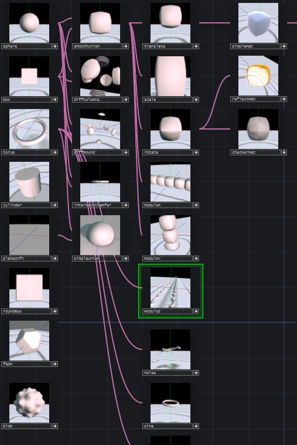

# TDraymarchToolkit
A Raymarch Toolkit for TouchDesigner


## Usage:
press shift+right click to open op create dialog for RTK. Place some ops, create a standard TouchDesigner render TOP, camera COMP and Light COMP to make use of RTKs render OP.

## Limitations/known Issues:
- You cannot rename OPs without running into problems.
- only one light supported
- interpolation between 3 or more materials is broken.
- the total maximum number of parameters is set to 100 and hard-coded at the moment. It is very easy to change that and will be adjustable soon. (Just in case you try to build something large [which I don't recommend at this point] and it breaks because of that[index error on ```params``` array.])

## Working with textures
The RTK Component has a parameter ```Textures Comp```. Here a bas Comp is expected. in this component a number of TOPs can be placed. These should be named ```textureN``` where ```N``` is a number. When you add a texture, the ```reload textures``` pulse parameter of the RTK Component needs to be pulsed.



## Make your own OPs
Please note that there is quite a big library of SDF functions included in this project (see references below). It is located at ```/project1/RTK/hg_sdf1```. Most if the stuff there is not yet implemented as an OP in this toolkit and its very simple to do that. You can simply make a new OP that just uses one of the functions from the lib (see for example the fGDF-op).

Also, if you make new OPs, consider sharing them/making a pull request.

Let's go through an example, we want to create an OP that can only translate in Y for some reason.
1. Go to ```/project1/RTK/operators```. Here you can find all the ops that where created so far. 
2. Copy one of them. Copy something simple and similar to what you want to achieve, for example the ```Translate``` OP.
3. Rename your new OP. We'll rename it ```translateY```.
4. Make your changes:
	- Rewrite the function now located at ```/project1/RTK/operators/translateY/processfun```. We will change it to contain the code:
	``` 
	Sdf thismap(vec3 p){
	p.y -= @Translate;
	return inputOp1(p);
	}
	```

Please note: Your function needs to take a vec3 and return a Sdf. Variables beginning with ```@``` are going to be parsed to reference the components custom parameters. ```inputOP1``` will be parsed to reference the OP's input.
The Sdf struct currently contains the following:
```
struct Sdf
{
	float x; // distance
	float y; // material ID
	bool reflect; // do reflection for this?
	bool refract; // do refraction for this?
	float material2; // in case of interpolating, the second material
	float interpolant; // in case of interpolating, the interpolation value
};
```


- customize your component to have exactly the right parameters. In our case we delete the original Transformxyz and add a float named ```Translate```. Only Floats and XYZ type parameters are supported at the moment.

5. go to ```/project1/RTK/operators/translateY/filterSetup``` and run the ```filterSetup``` script. 
6. Add your new op to the menu: go to ```/project1/RTK/menu/menu``` and add an entry in the ```table1``` in the corresponding column. It needs to be exactly the name of your new op.

## New Materials
Creating a new material is similar to creating a new OP.
Copy for example the simple mat. Adjust the ```material``` text DAT inside. You can use all the stuff that is in the comment in the top line. For example ```ref``` contains the reflection color or ```refraction``` contains the refracted color(transparency color).
If you want to use refraction or refraction, you also have to modify the material's ```process fun``` text DAT so e.g. ```res.refract = true```.
After all that, rename the OP, run the ```filterSetup``` script as with a filter OP *and* run the ```matSetup/matSetupScript```.


## References
Thanks to [MERCURY](http://mercury.sexy), (their [library](http://mercury.sexy/hg_sdf) is included here) and [Inigo Quilez](https://www.iquilezles.org/index.html) for all the good articles and formulas. Please check MERCURY's licence.